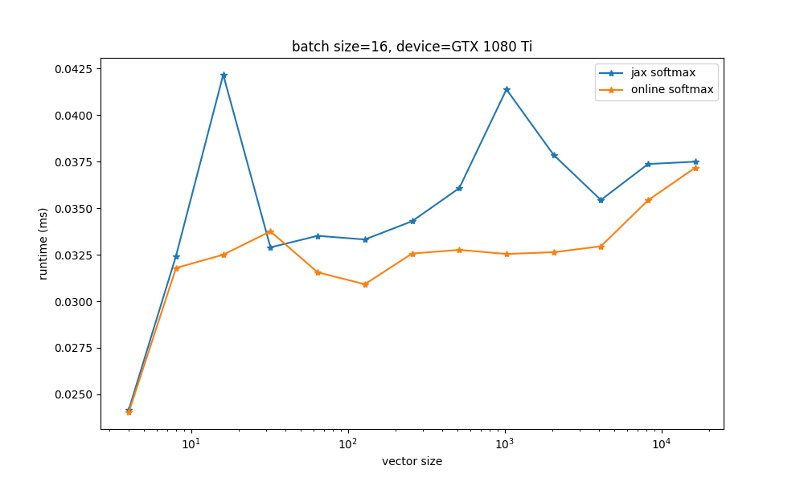

Jax Online Softmax
==================

This is a jax implementation of [*Online normalizer calculation for softmax*](https://arxiv.org/abs/1805.02867v2).
The idea here was to experiment with ways of making attention slightly faster.
[`online_softmax`](https://github.com/jenkspt/online-softmax-jax/blob/main/src/online_softmax.py#L7-L26) calculates the max value `c = max(x)` and the normalizer `n = exp(x - c)` in a single parallel reduction.

The [`online_softmax_dot`](https://github.com/jenkspt/online-softmax-jax/blob/main/src/online_softmax.py#L29-L56) combines a softmax and dot product (i.e. `sum(softmax(x) * v)` into a single parallel reduction.

As it turns out, neither of these are reliably faster than the naive jitted jax implementations, however `online_softmax_dot` should be more memory efficient. Unfortunately for reasons somewhat unclear to me, it also has numerical stability issues for large input sizes.

`online_softmax_dot` could potentially have a faster backward pass as well -- but since the forward pass results aren't entirely promising, I'm not going to implement the backward pass.




These benchmarks have similiar results on TPUv2 and T4 GPU

# Citations
```bibtex
@misc{https://doi.org/10.48550/arxiv.1805.02867,
  doi = {10.48550/ARXIV.1805.02867},
  
  url = {https://arxiv.org/abs/1805.02867},
  
  author = {Milakov, Maxim and Gimelshein, Natalia},
  
  keywords = {Performance (cs.PF), Artificial Intelligence (cs.AI), Computation and Language (cs.CL), FOS: Computer and information sciences, FOS: Computer and information sciences},
  
  title = {Online normalizer calculation for softmax},
  
  publisher = {arXiv},
  
  year = {2018},
  
  copyright = {arXiv.org perpetual, non-exclusive license}
}
```
